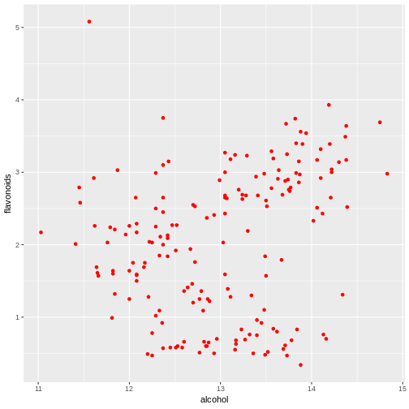

Reproducible Pitch Presentation
========================================================
author: ps7391
date: February 11, 2019
autosize: true
## Shiny Application and Reproducible Pitch
### Display of Dependence of flavonoid content on alcohol content wines

Assignment
========================================================

Presentation must satisfy the following:

1. It must be done in Slidify or Rsudio Presenter
2. It must be 5 pages
3. It must be hosted on github or Rpubs
4. It must contained some embedded R code that gets run when slidifying the document

Shiny Application
========================================================

The name of the application is "Display of Dependence of flavonoid content on alcohol content wines".

This app uses the dataset Wines. This dataset is part of the kohonen package.

This dataset provides various characteristics of wines.

Packages are used for interactivity in the application plotly and ggplot2.


You can download the shiny application for this repository and run it from you R-Studio using https://github.com/p7391s/Developing_Data_Products

Instructions to run it
========================================================

Using the slider you choose the number of wines for which the dependence of the amount of alcohol on flavonoids will be displayed. The application shows the number of wines you have selected for selection.
Graphics made using the package ggplot2.


```r
    g <- ggplot(data, aes(alcohol, flavonoids)) +
      geom_point(color = "red")
    g
```


If in the application you mouse over a point on the graph, then the characteristics of the fault will be displayed thanks to the use of the graph package.

Example plot from the application
========================================================


